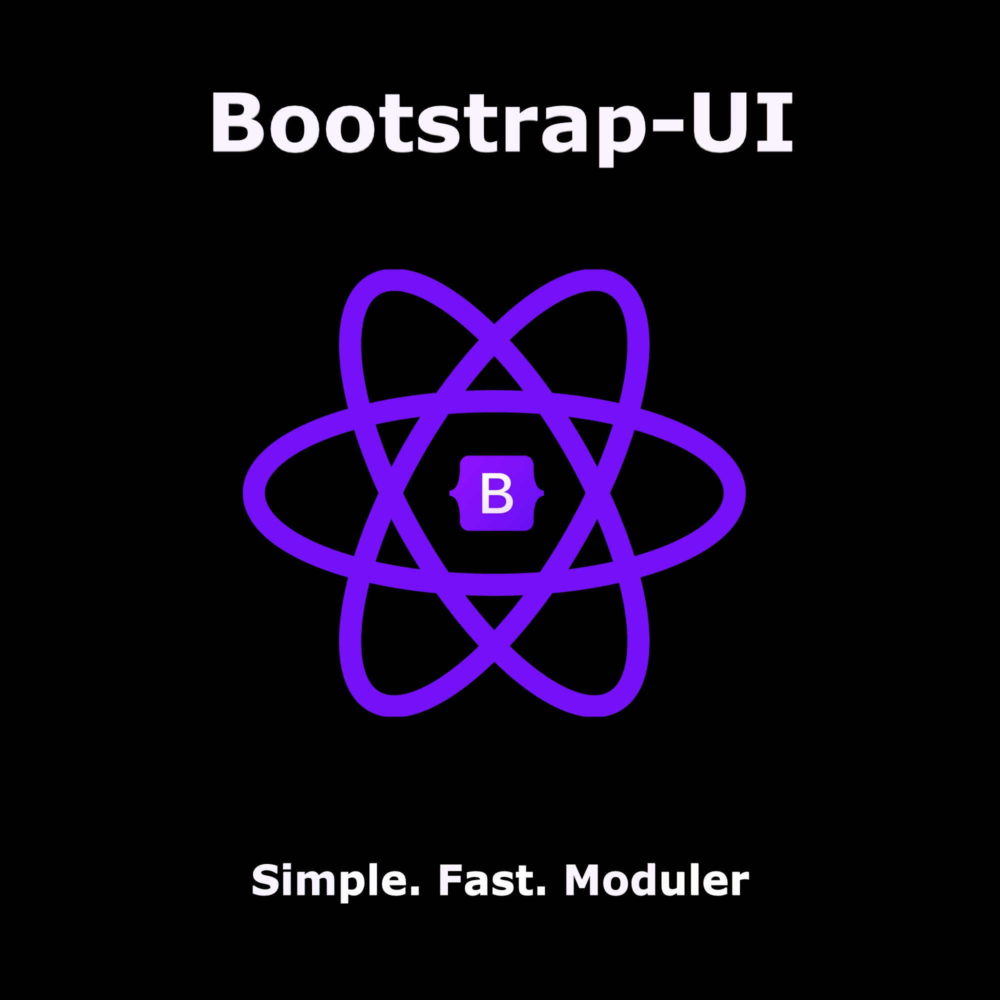

# **Bootstrap UI**

Simple, fast and moduler React component library basis on [**Bootstrap**](https://getbootstrap.com/) styles for fast creating web apps. Documentation generate by [**Storybook**](storybook.js.org).

>Bootstrap [v5.1.3](https://www.npmjs.com/package/bootstrap)



## **Features**
The library differs from others in the fast release of new features from the Bootstrap Team and the fact that all functional components without TypeScript
+ 💥 Install library via NPM
+ 🔥 Fast support Bootstrap last features
+ 🧾 Documents generate by Storybook
+ 📖 Many informative, original and honest examples
+ ✨ Clean `JavaScript` (without `TypeScript`)

## **Preparation**

If you have not created a project yet, I advise you to create it through [`create-react-app`](https://create-react-app.dev). This is most simple way.

```shell
# via npx
npx create-react-app [project-name]
```

This components library usage [**Boostrap**](https://getbootstrap.com) package. Before install library you need
install original package via `npm`

```shell
# via npm
npm i bootstrap
```

and you need import Bootstrap styles and script in `index.js` or `App.[js|jsx]` file (to your notice):

```js
// CSS
import 'bootstrap/dist/css/bootstrap.min.css';

// Scripts
import 'bootstrap/dist/css/bootstrap.min.css';
```

## **Instalation**
If you successed complete **Preparation** block, go to install components library:

```shell
# via npm
npm i bootstrap-ui
```

## **Import**
For example we import `Badge` component from a library
```js
import { Badge } from 'bootstrap-ui';
import Badge from 'bootstrap-ui/Badge';
```

## **Layout**
`Grid` is a basic **Bootstrap** system for creating adaptive web apps
```js
import { Container, Row, Col } from 'bootstrap-ui';
// equivalent usage object Grid
// import { Grid } from 'bootstrap-ui'
// <Grid.Container /> === <Container>,
// <Grid.Row /> === <Row />
// <Grid.Col /> === <Col />

export default function Example() {
  return (
    <Container>
      <Row cols={2}>
        <Col>Column #1</Col>
        <Col>Column #2</Col>
        <Col>Column #3</Col>
        <Col>Column #4</Col>
      </Row>
    </Container>
  )
}
```

## **Support**
+ ✅ Accordion
+ ✅ Alert
+ ✅ Badge
+ ✅ Breadcrumb
+ ✅ Button
+ ✅ ButtonGroup
+ ✅ Card
+ ✅ Carousel
+ ✅ CloseButton
+ ✅ Collapse
+ ✅ Container
+ ✅ Row
+ ✅ Dropdown
+ ✅ ListGroup (unstable)
+ ⬜ Modal
+ ✅ Nav (unstable)
+ ⬜ Tab
+ ✅ Navbar (unstable)
+ ⬜ Offcanvas
+ ⬜ Pagination
+ ⬜ Placeholder
+ ✅ Progress (unstable)
+ ✅ Spinner
+ ⬜ Toast
+ ✅ Box
+ ✅ Flex
+ ✅ Heading
+ ✅ Text

Good luck! The end...